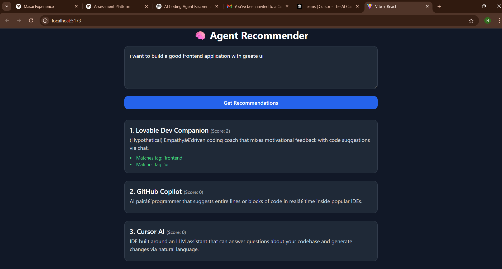

# 🧠 AI Coding Agent Recommender

This project is a web-based system that recommends the best AI coding agents (like Copilot, Cursor, Replit, etc.) based on your natural language task description.

---

## 🚀 Features

* 📝 **Task Input Interface** – Describe your coding task in plain English
* 🤖 **LLM-Powered Classification** – Tags extracted using a local LLM via [Ollama](https://ollama.com/)
* 📊 **Agent Scoring Engine** – Ranks agents based on task relevance
* 🔍 **Explanation for Rankings** – Each recommendation includes matched reasons
* 🌐 **Frontend UI** – Clean and modern React + Tailwind interface

---

## 📸 Demo Screenshot

> *⬇️ Replace the placeholder below with a real screenshot of the UI + results:*



---

## 🏗️ Tech Stack

| Layer    | Tech Used                        |
| -------- | -------------------------------- |
| Frontend | React, TailwindCSS, Vite         |
| Backend  | Flask, Python                    |
| LLM      | Ollama (e.g., mistral\:instruct) |
| Data     | agents\_db.json                  |

---

## 📁 Folder Structure

```
agent-recommender/
├── backend/
│   ├── app.py
│   ├── recommendation_engine.py
│   └── agents_db.json
├── frontend/
│   ├── src/
│   │   ├── AgentRecommender.jsx
│   │   └── main.jsx
│   ├── index.html
│   └── tailwind.config.js
├── demo/
│   └── screenshot.png
└── README.md
```

---

## 🧪 How to Run

### 🔹 Backend (Flask + Ollama)

```bash
cd backend
python -m venv venv
venv\Scripts\activate  # or `source venv/bin/activate` on mac/linux
pip install flask flask-cors
python app.py
```

Ensure you have [Ollama](https://ollama.com/) and the model installed:

```bash
ollama run mistral:instruct
```

---

### 🔹 Frontend (Vite + Tailwind)

```bash
cd frontend
npm install
npm run dev
```

Then open [http://localhost:5173](http://localhost:5173) in your browser.

---

## 🧠 Add More Agents

Edit `agents_db.json` to add your own coding assistants:

```json
{
  "id": "myagent",
  "name": "My AI Dev Helper",
  "description": "Helps you write Go code with unit tests.",
  "tags": ["golang", "testing", "cli"],
  "best_for": ["writing tests", "command-line tools"]
}
```

---

## 📌 Notes

* You can improve performance by tuning the system prompt.
* The tag set is currently fixed but easily extendable.

---

## ✨ Future Ideas

* Support for multi-model comparison
* Auto-update agent database via API
* Feedback-based ranking improvement

---

## 📄 License

MIT License.

---

*🧠 Built for AI-enhanced software productivity.*
