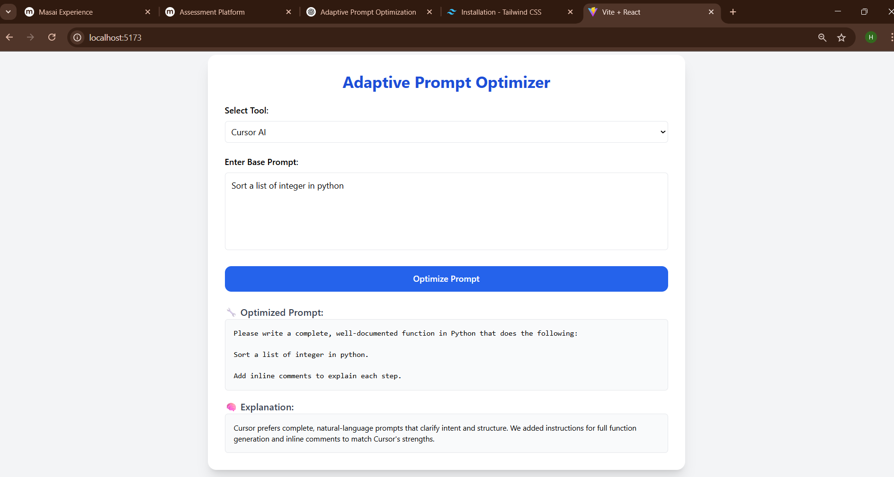

# Adaptive Prompt Optimizer

## 🚀 Overview

The **Adaptive Prompt Optimizer** is an intelligent tool that automatically transforms and optimizes prompts for different AI coding assistants. Each AI tool has unique strengths and preferred prompt styles - this project bridges that gap by providing tool-specific prompt optimization to maximize the effectiveness of your coding queries.



## 🎯 Problem & Solution

Different AI coding tools excel with different prompt styles:
- **GitHub Copilot** works best with inline comments and complete function signatures
- **Cursor AI** prefers precise, natural-language instructions  
- **Replit** favors step-by-step REPL-style outputs
- **Amazon CodeWhisperer** excels with security-focused, AWS-aligned prompts
- **Tabnine** optimizes for cross-language, enterprise-grade completions

Writing optimal prompts for each tool manually is time-consuming and requires deep knowledge of each tool's capabilities.

## ✨ Features

- **Multi-Tool Support**: Optimized for 5+ major AI coding assistants
- **Intelligent Rewriting**: Context-aware prompt transformation
- **Before/After Comparison**: Clear diff view of prompt changes
- **Detailed Explanations**: Understand why each change was made
- **RESTful API**: Easy integration with existing workflows

## 🛠️ Supported Tools

| Tool | Key Optimizations |
|------|------------------|
| **GitHub Copilot** | Agent mode, multi-model support, deep IDE integration |
| **Amazon CodeWhisperer** | Security scanning, AWS ecosystem alignment |
| **Cursor AI** | Natural-language editing, codebase understanding |
| **Replit Agent** | Cloud-first development, collaborative coding |
| **Tabnine** | Privacy-first, enterprise-grade, multi-language |

## 📁 Project Structure

```
adaptive_prompt_optimizer/
├── app.py                # Flask API server
├── tool_analysis.json    # AI tool metadata database
├── optimizers/           # Tool-specific optimization modules
│   ├── copilot.py       # GitHub Copilot optimizer
│   ├── cursor.py        # Cursor AI optimizer
│   ├── replit.py        # Replit optimizer
│   ├── codewhisperer.py # Amazon CodeWhisperer optimizer
│   └── tabnine.py       # Tabnine optimizer
├── templates/            # Web UI templates
│   └── index.html
└── README.md
```

## 🚀 Quick Start

### Installation

```bash
git clone https://github.com/yourusername/adaptive-prompt-optimizer.git
cd adaptive-prompt-optimizer
pip install -r requirements.txt
python app.py
```

### Usage

1. **Web Interface**: Open `http://localhost:5000`
2. Enter your base prompt
3. Select your target AI coding tool
4. Get optimized prompt with explanations
5. Copy and use with your chosen tool

### API Usage
```bash
curl -X POST http://localhost:5000/api/optimize \
  -H "Content-Type: application/json" \
  -d '{
    "prompt": "Create a function to sort an array",
    "tool": "cursor"
  }'
```

## 🔧 How It Works

### Tool Analysis Database
The `tool_analysis.json` file contains metadata for each AI tool including latest features, strengths, and optimal use cases.

### Optimizer Modules
Each tool has a dedicated optimizer that applies specific transformations:
```python
def optimize_prompt(base_prompt: str) -> dict:
    return {
        "optimized_prompt": transformed_prompt,
        "explanation": "Reasoning for the changes made"
    }
```

## 🤝 Contributing

1. Fork the repository
2. Create a feature branch (`git checkout -b feature/new-tool`)
3. Commit your changes (`git commit -m 'Add new tool support'`)
4. Push to the branch (`git push origin feature/new-tool`)
5. Open a Pull Request

## 📄 License

This project is licensed under the MIT License.

---

**Made with ❤️ for the coding community**